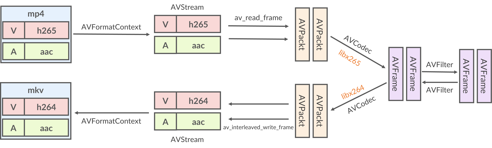

# Remuxing

重封装，将文件的封装格式转换为指定格式，例如 mkv 格式转换为 mp4 封装格式。重封装通常不会修改内部流的数据。

## 等效FFmpeg命令

```bash
ffmpeg -i hevc.mkv hevc.mp4
```

## FFmpeg 的组成

- `libavutil`: 通用组件库
- `libswscale`: 高度优化的图像缩放、颜色空间和像素格式转换库
- `libswresample`: 高度优化的 音频重采样(resampling)、rematrixing 和采样格式(sample format)转换操作的库
- `libavcodec`: 音视频的编解码器
- `libavformat`：封装(muxing)和解封装(demuxing)
- `libavdevice`: 输入输出设备相关，包括 Video4Linux2, VfW, DShow 和 ALSA
- `libavilter`：音视频通用滤波器

## 视频封装格式与视频协议

- `Protocol`: 协议，例如 HTTP/RTMP/FILE
- `Format`: 封装格式，例如 .mkv/.mp4/.mp3
- `Codec`: 编码/解码，压缩数据，例如 h264/h265/aac
- `Pixel`: 原始数据帧，帧的像素格式(pixel format)例如，YUV420P, RGB24

## 流程

一个包括了 重封装、转码、滤波的完整流程如下图:



重封装只需要 *解封装* 获取到视频流后 *封装* 就可以了。

## hard way

FFmepg的解协议和解封装是在一起的，这里我们先忽略解协议。一个输入文件的整体信息使用`AVFormatContext`进行管理：

```c
// 分配内存，ffmpeg 自定的结构体大多有对应的分配和释放内存的函数
AVFormatContext * decoder_fmt_ctx = avformat_alloc_context();

// 打开输入文件，具体的参数意义建议直接去查看ffmpeg函数定义的注释
avformat_open_input(&decoder_fmt_ctx, in_filename, nullptr, nullptr)
```

打开文件后，读取文件的流信息(stream information):

```c
avformat_find_stream_info(decoder_fmt_ctx, nullptr)
```

音视频流的获取：

```c
decoder_fmt_ctx->nb_streams     // 流的数量
decoder_fmt_ctx->streams        // 具体的AVStream流，音视频都是AVStream

// 流的类型
decoder_fmt_ctx->streams[i]->codecpar->codec_type // AVMEDIA_TYPE_UNKNOWN / AVMEDIA_TYPE_VIDEO /AVMEDIA_TYPE_AUDIO ...
```

对于重封装来说，获取到音视频流就可以了，接下来就是 准备输出文件 的信息，输出文件同样用 `AVFormatContext` 管理：

```c
AVFormatContext * encoder_fmt_ctx = nullptr;
// 这里的封装格式 使用 输出文件的后缀名来 确定
avformat_alloc_output_context2(&encoder_fmt_ctx, nullptr, nullptr, out_filename)
```

然后，要为输出文件创建对应输入文件的音视频流，每个输入流对应一个输出流，stream的创建为：

```c
AVStream * encode_stream = avformat_new_stream(encoder_fmt_ctx, nullptr);

// 因为重封装不修改流的内容，直接复制输入流的参数到输出流中
avcodec_parameters_copy(encode_stream->codecpar, decoder_fmt_ctx->streams[i]->codecpar)
```

这样，输出的信息就准备完毕，接下来创建输出文件：

```c
// 打开输出文件
if(!(encoder_fmt_ctx->oformat->flags & AVFMT_NOFILE)) {
    avio_open(&encoder_fmt_ctx->pb, out_filename, AVIO_FLAG_WRITE)
}
// 写入流的信息
avformat_write_header(encoder_fmt_ctx, nullptr)
```

最后，读取输入文件的数据并写入到输出中，

```c
while(av_read_frame(decoder_fmt_ctx, packet) >= 0) {
    // 根据流的time_base缩放时间戳，暂时可以略过
    av_packet_rescale_ts(packet, decoder_fmt_ctx->streams[packet->stream_index]->time_base, encoder_fmt_ctx->streams[stream_mapping[packet->stream_index]]->time_base);

    // 直接使用读取的packet，只要修改流的索引为输出文件中对应的索引
    packet->stream_index = stream_mapping[packet->stream_index];

    // 写入
    av_interleaved_write_frame(encoder_fmt_ctx, packet)

    // 解引用，packet是用引用计数来管理的，av_packet_unref会重置packet中的数据指针，如果指向的数据的计数为0会被释放
    // 必须调用该函数
    av_packet_unref(packet);
}
```

最后需要关闭文件以及释放分配的资源等。