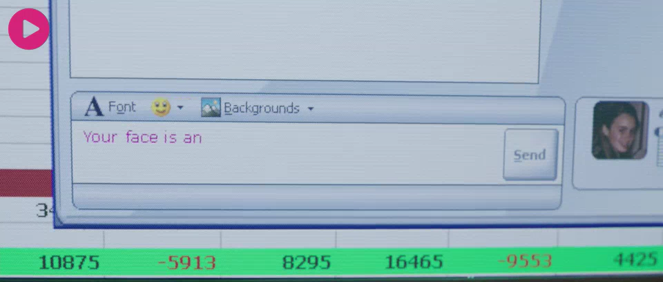

# Complex filter

使用复杂滤波器为视频添加图片水印。 将图片


作为水印添加到视频的左上角，效果如下

.

等效FFmpeg命令：

```bash
ffmpeg -hide_banner -i .\images\watermark.png -i .\hevc.mkv -filter_complex "[0:v] scale=64:-1:flags=lanczos,vflip [s];[1:v][s]overlay=10:10" out.mp4
```

## 图片解码

png图片的解码和视频解码完全一样，但是只有1帧，因此要正确获取解码器中缓存的帧。

## 查看滤波器参数

```bash
ffmpeg -hide_banner -h filter=overlay

# Output
Filter overlay
  Overlay a video source on top of the input.
    slice threading supported
    Inputs:
       #0: main (video)
       #1: overlay (video)
    Outputs:
       #0: default (video)
overlay AVOptions:
  x                 <string>     ..FV....... set the x expression (default "0")
  y                 <string>     ..FV....... set the y expression (default "0")
  eof_action        <int>        ..FV....... Action to take when encountering EOF from secondary input  (from 0 to 2) (default repeat)
     repeat          0            ..FV....... Repeat the previous frame.
     endall          1            ..FV....... End both streams.
     pass            2            ..FV....... Pass through the main input.
  eval              <int>        ..FV....... specify when to evaluate expressions (from 0 to 1) (default frame)
     init            0            ..FV....... eval expressions once during initialization
     frame           1            ..FV....... eval expressions per-frame
  shortest          <boolean>    ..FV....... force termination when the shortest input terminates (default false)
  format            <int>        ..FV....... set output format (from 0 to 7) (default yuv420)
     yuv420          0            ..FV.......
     yuv420p10       1            ..FV.......
     yuv422          2            ..FV.......
     yuv422p10       3            ..FV.......
     yuv444          4            ..FV.......
     rgb             5            ..FV.......
     gbrp            6            ..FV.......
     auto            7            ..FV.......
  repeatlast        <boolean>    ..FV....... repeat overlay of the last overlay frame (default true)
  alpha             <int>        ..FV....... alpha format (from 0 to 1) (default straight)
     straight        0            ..FV.......
     premultiplied   1            ..FV.......

framesync AVOptions:
  eof_action        <int>        ..FV....... Action to take when encountering EOF from secondary input  (from 0 to 2) (default repeat)
     repeat          0            ..FV....... Repeat the previous frame.
     endall          1            ..FV....... End both streams.
     pass            2            ..FV....... Pass through the main input.
  shortest          <boolean>    ..FV....... force termination when the shortest input terminates (default false)
  repeatlast        <boolean>    ..FV....... extend last frame of secondary streams beyond EOF (default true)

This filter has support for timeline through the 'enable' option.
```

### 多输入录波器设置(framesync)

一些多输入的滤波器(比如添加水印用的overlay)支持相同的一组[设置](https://ffmpeg.org/ffmpeg-filters.html#Options-for-filters-with-several-inputs-_0028framesync_0029):

- eof_action: 第二个输入`EOF`时因该如何执行，支持以下设置
  - repeat: 重复最后一帧(默认值)
  - endall：结束所有流
  - pass：Pass the main input through.
- shortest：如果设置为1，最短的输入结束时强制输出结束。默认为0。
- repeatlast：如果设置为1，强制滤波器重复第二个流的最后一帧直到主流结束。默认值为1。


## 复杂滤波器

